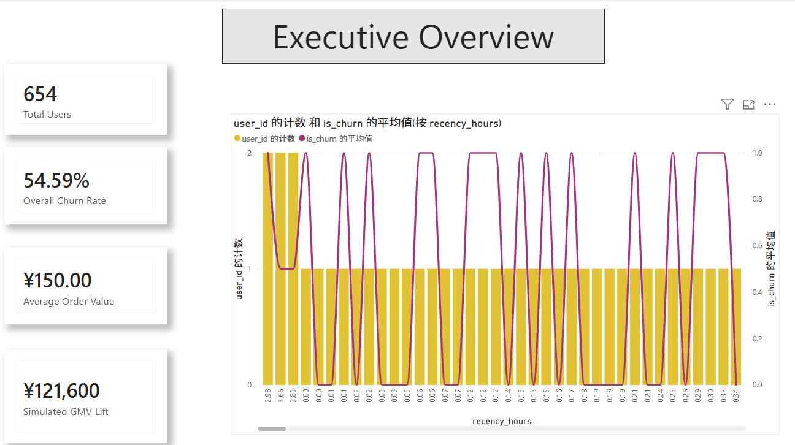
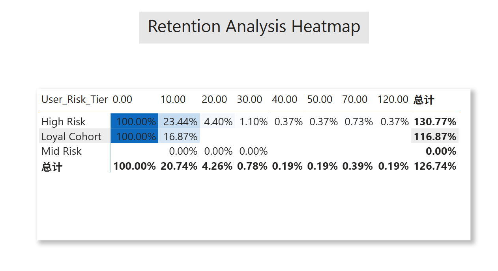
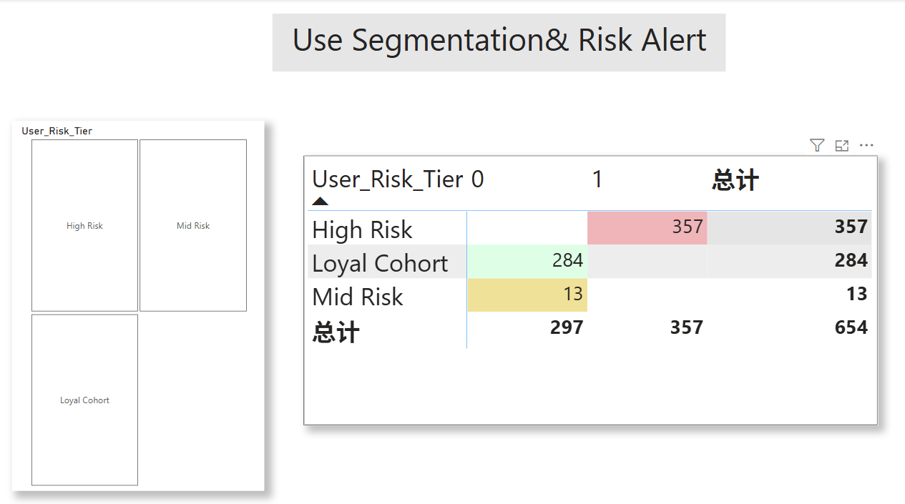
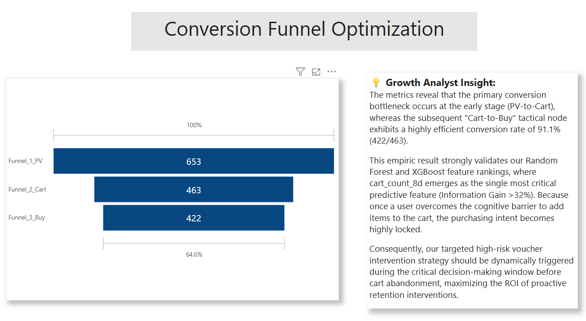

# E-Commerce User Churn Prediction & Systematic Retention Pipeline

This project focuses on predicting potential user churn in an e-commerce platform using behavioral interaction data.The project covers the complete data analysis workflow, including **SQL-based feature engineering**, **churn prediction modeling**, **A/B testing analysis**, and **Power BI dashboard visualization**.The main objective is to identify users with high churn risk based on recent behavioral activity and support retention strategy optimization through data-driven analysis.

---

## 📌 1. Business Problem & Feature Design

* **Business Problem**: In e-commerce platforms, retaining existing users is usually more cost-effective than acquiring new users.Traditional descriptive analysis can identify inactive users after churn has already happened, but it is less effective for early intervention.This project aims to build a simple churn prediction workflow using recent user behavior data to identify users with high churn risk in advance.
* **Churn Definition**: In this project, a user is labeled as churn-risk **(`is_churn = 1`)** if no **Carting (`cart`)** or **Purchasing (`buy`)** behavior occurs during the following 1-day observation period after the feature window.An 8-day activity window was used to generate behavioral features because shorter windows produced sparse user activity and unstable aggregation results during initial testing.
* **Feature Engineering**:
  * **recency_hours**:Measures how long it has been since the user's last interaction with the platform. Users with longer inactivity periods are more likely to churn.
  * **pv_count_8d, fav_count_8d, cart_count_8d, buy_count_8d**: Measure user activity frequency during the 8-day observation window.
  * **pv_to_buy_ratio**: Measures the conversion relationship between browsing and purchasing behavior. A high browsing volume with low purchase activity may indicate weaker purchase intention or higher conversion friction.
During feature analysis, **cart_count_8d** showed stronger predictive power than simple page-view behavior, suggesting that purchase-intent actions are more useful for identifying potential churn users.

---

## 🛠️ 2. SQL Feature Engineering Pipeline

Raw user behavior logs were processed using SQL to generate a structured feature table for churn prediction modeling.
A sliding-window approach was used to separate the feature generation period from the churn observation period:
(1).The first 8 days were used to calculate user behavioral features.
(2).The following 1-day window was used to determine whether the user showed potential churn behavior.
Common Table Expressions (CTEs) and conditional aggregation were used to construct user-level behavioral features from raw transaction logs.
A total of 654 active users were extracted, including 357 churn-risk users (**is_churn = 1**).
**Main Feature Construction Logic**:
**recency_hours**measures the time gap between the user's latest interaction and the end of the feature window.
**pv_count_8d, fav_count_8d, cart_count_8d, and buy_count_8d**measure user activity frequency during the observation period.
**is_churn**is labeled as 1 if the user has no **cart** or **buy** behavior during the following 1-day observation window.
**pv_to_buy_ratio** was added to reflect the conversion relationship between browsing and purchasing behavior.
During preprocessing, users with no meaningful activity records were filtered out to reduce noise in the training dataset.

### 🗄️ Feature Extraction Pipeline (`user_churn_etl.sql`)
```sql
USE taobao_analysis;

CREATE TABLE user_churn_features AS
WITH base_features AS (
    SELECT 
        user_id,
        -- [Recency] Hours elapsed since user's last interaction relative to feature window boundary (2017-12-02 23:59:59)
        (1512229199 - MAX(CASE WHEN timestamp <= 1512229199 THEN timestamp END)) / 3600 AS recency_hours,
        
        -- [Frequency] Behavior aggregations across the 8-day feature generation window
        COUNT(CASE WHEN behavior_type = 'pv' AND timestamp <= 1512229199 THEN 1 END) AS pv_count_8d,
        COUNT(CASE WHEN behavior_type = 'fav' AND timestamp <= 1512229199 THEN 1 END) AS fav_count_8d,
        COUNT(CASE WHEN behavior_type = 'cart' AND timestamp <= 1512229199 THEN 1 END) AS cart_count_8d,
        COUNT(CASE WHEN behavior_type = 'buy' AND timestamp <= 1512229199 THEN 1 END) AS buy_count_8d,
        
        -- [Labeling] High-risk flag: 1 if no deep intent actions (cart/buy) occur in the subsequent 1-day observation window
        CASE WHEN COUNT(CASE WHEN behavior_type IN ('cart', 'buy') AND timestamp > 1512229199 THEN 1 END) = 0 THEN 1 ELSE 0 END AS is_churn
    FROM user_behavior
    GROUP BY user_id
)
SELECT 
    user_id,
    COALESCE(recency_hours, 192) AS recency_hours, -- Penalty max value: 8 days = 192 hours
    pv_count_8d,
    fav_count_8d,
    cart_count_8d,
    buy_count_8d,
    CASE WHEN pv_count_8d > 0 THEN buy_count_8d / pv_count_8d ELSE 0 END AS pv_to_buy_ratio,
    is_churn
FROM base_features
WHERE pv_count_8d > 0 OR cart_count_8d > 0;

````
---

## 📊 3. Churn Prediction Modeling

A **Random Forest Classifier** was used to predict potential churn users based on behavioral features.Logistic Regression was initially tested as a baseline model because of its simplicity and interpretability. However, user behavioral patterns showed nonlinear relationships, especially between carting and purchasing actions, which limited the model performance.Random Forest was later selected because it achieved better recall performance while still providing interpretable feature importance results.

* 📁 **Core Modeling Framework**: [`Churn_Prediction_Framework.ipynb`](Churn_Prediction_Framework.ipynb)
* **Model Optimization**:
  * **Asymmetric Risk Strategy**: The classification threshold was adjusted from the default value of **0.50** to **0.40** in order to improve recall performance.
  * **Empirical Results**: From a business perspective, missing potential churn users was considered more costly than sending unnecessary retention coupons.The final model achieved a recall score of **94.4%**, successfully identifying most high-risk churn users in the testing dataset.
* **Feature Importance Analysis**:
  * Feature importance analysis showed that cart_count_8d was one of the strongest predictors in the model.This suggests that cart-related behaviors carry stronger purchase intent signals compared with simple browsing behavior (pv_count_8d).Users who previously showed strong purchase intent but suddenly stopped interacting were more likely to become churn-risk users.

---

## 🚀 4. Retention Strategy Analysis

Based on the predicted churn probability and historical user activity, several retention strategies were designed for different user groups.

| User Segment | Churn Risk | Historical Value Tier | Suggested Retention Strategy |
| :--- | :--- | :--- | :--- |
| **High-Value / High-Risk Users** | High churn probability with strong historical purchasing behavior | Provide discount coupons or personalized notifications to encourage re-engagement |
| **Medium-Value / High-Risk Users** | Moderate purchasing activity with increasing inactivity | Recommend related products and category-specific promotions |
| **Low-Value / High-Risk Users** | Low activity and low historical spending | Use low-cost engagement strategies such as loyalty programs or daily check-in activities |

### 📈 Business Impact Estimation
A simple business impact estimation model was used to simulate the potential value of the retention strategy:

$$Delta GMV = N_{target} \times Recall \times ConversionRate \times AOV - Cost_{coupons}$$

Assuming 10,000 high-risk users are identified by the model:
(1).Model recall: **94.4%**
(2).Estimated reactivation conversion rate: **10%**
(3).Average order value (AOV): **150 RMB**
Under this simplified simulation, the retention strategy could potentially recover part of the lost revenue while maintaining reasonable coupon costs.
The calculation is intended as a business estimation example rather than a real production revenue forecast.

---

## 🧪 5. Cohort Analysis & A/B Testing

To further evaluate whether retention interventions could improve user engagement, a simple A/B testing analysis was conducted.

Users were divided into two groups:
(1).Control Group: users who did not receive retention incentives
(2).Treatment Group: users who received targeted voucher interventions

* 📁 **Analytics & Testing Engine**: [`retention_ab_test_analyzer.ipynb`](retention_ab_test_analyzer.ipynb)
* **Experimental Results**:
  Control Group 7-day retention rate: 21.5%
  Treatment Group 7-day retention rate: 28.8%
  The treatment group showed a 7.3% improvement in retention performance compared with the control group.
  
* **Statistical Testing**:An independent two-sample t-test was performed to determine whether the observed retention improvement was statistically significant.
  * **T-Statistic**: `-3.7737`
  * **P-Value**: `1.6553e-04` ($\alpha < 0.01$)
  * **Conclusion**: Since the p-value was smaller than 0.01, the null hypothesis was rejected.This suggests that the retention intervention strategy may have a positive impact on short-term user retention performance.

---

## 📈 6. Executive Power BI Dashboards

The repository delivers both interactive enterprise `.pbix` source files and embedded visual showcases. To examine the dynamic relationships, download the source assets via the links below.

### 📂 Dashboard Source Artifacts
* 📊 **Executive Overview Source**: [`dashboards/Executive_Overview.pbix`](dashboards/Executive_Overview.pbix)
* 📊 **User Segmentation Source**: [`dashboards/User_Segmentation.pbix`](dashboards/User_Segmentation.pbix)
* 📊 **Retention Heatmap Source**: [`dashboards/Retention_Heatmap.pbix`](dashboards/Retention_Heatmap.pbix)
* 📊 **Funnel Optimization Source**: [`dashboards/Funnel_Optimization.pbix`](dashboards/Funnel_Optimization.pbix)

### 🎨 System Visual Showcase

<div align="center">
  
  <p><i>Figure 1:Executive dashboard showing overall user count, churn rate, average order value, and churn-related behavioral trends.</i></p>
</div>

<br>

<div align="center">
  
  <p><i>Figure 2: Retention heatmap comparing retention performance across different user risk groups over time.</i></p>
</div>

<br>

<div align="center">
  
  <p><i>Figure 3: User segmentation dashboard showing churn-risk group distribution based on model prediction results.</i></p>
</div>

<br>

<div align="center">
  
  <p><i>Figure 4: Conversion funnel analysis showing the transition from page view to cart and purchase behavior.</i></p>
</div>

---

## 📂 7. Repository Layout

```text
├── README.md                           # Master Project Documentation & Business Spec
├── user_churn_etl.sql                  # Production SQL Feature Engineering Pipeline
├── Churn_Prediction_Framework.ipynb    # Random Forest Classifier Training & Evaluation
├── retention_ab_test_analyzer.ipynb    # Integrated Cohort Matrix & Automated T-Test Pipeline
├── Result_Data/                        # Simulated Experiment Output Log Aggregations
├── dashboards/                         # Power BI Source Artifacts (.pbix files)
│   ├── Executive_Overview.pbix
│   ├── Funnel_Optimization.pbix
│   ├── Retention_Heatmap.pbix
│   └── User_Segmentation.pbix
└── assets/                             # System Showcase (High-Res Desktop Screenshots)
    ├── Page1_Executive_Overview.png    
    ├── Page2_User_Segmentation.png     
    ├── Page3_Retention_Heatmap.png     
    └── Page4_Funnel_Optimization.png
