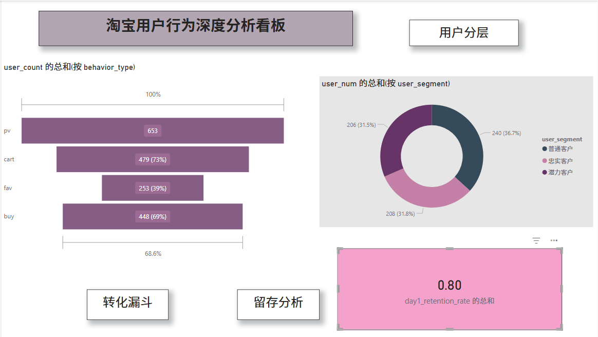

# Taobao-User-Behavior-Analysis
# 淘宝用户行为多维分析看板 (MySQL + Power BI)

## 📌 项目背景
本项目基于阿里巴巴提供的淘宝用户行为数据集（UserBehavior），对约 1 亿条用户行为记录进行深度挖掘。旨在通过大数据分析手段，还原用户从浏览到购买的转化路径，并对用户价值进行深度分层。

## 📊 核心分析模型
1. **转化漏斗 (AARRR)**: 追踪从 PV -> Cart/Fav -> Buy 的全链路转化率，识别流失点。
2. **留存分析**: 计算 Day 1 次日留存率，评估平台用户粘性。
3. **用户价值分层**: 利用简易 RFM 逻辑将用户划分为：忠实客户、普通客户、潜力客户。

## 🛠️ 技术实现
- **SQL (MySQL)**: 负责核心数据的指标提取。包含复杂窗口函数、时间戳转换及多维聚合逻辑。
- **Power BI**: 构建交互式可视化看板。实现自定义排序逻辑、KPI 监控及业务趋势展示。

## 🖼️ 看板效果展示
 

## 💡 业务洞察建议
- **转化优化**: 发现从加购到购买的转化率较高，但从浏览到加购的缺口较大，建议优化搜索算法和商品详情页展示。
- **人群策略**: 潜力客户占比约为 31.8%，可通过精准推送优惠券或新人礼包提高其转化动机。

---
**📂 文件说明**:
- `SQL_analysis_code.sql`: 完整的 SQL 建模与查询逻辑脚本。
- `Result_Data/`: 经过 SQL 处理后的核心指标 CSV 数据。
- `Taobao_Analysis_Report.pbix`: Power BI 可视化源文件。
